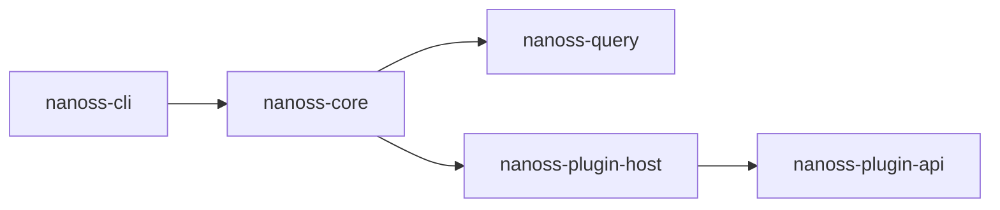
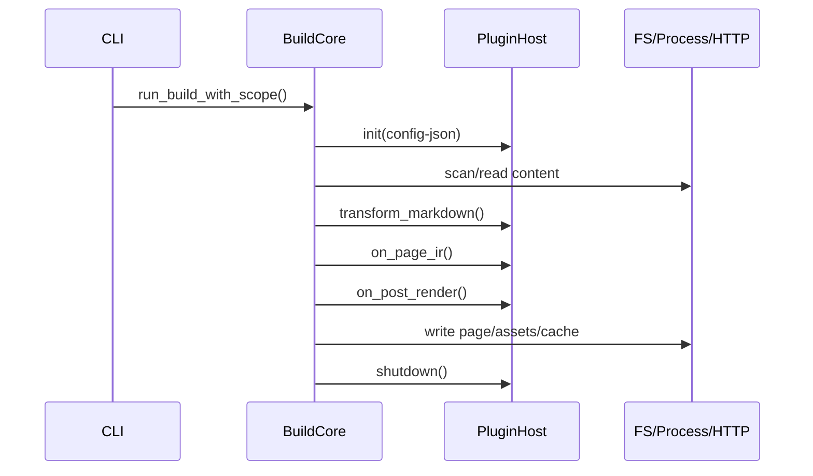
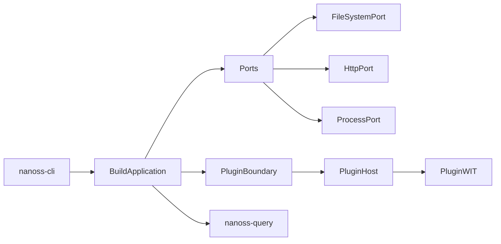

# Nanoss Architecture

## Build pipeline

1. Scan `content_dir` for markdown and assets.
2. For markdown files:
   - Use `nanoss-query` (Salsa) to compute a content hash.
   - Skip rendering when hash and output path match the build cache.
   - Execute plugin hooks:
     - `transform_markdown`
     - `on_page_ir`
     - `on_post_render`
  - Expand content shortcodes (``) into safe HTML/island placeholders.
  - Render markdown -> HTML with TOC, anchors, and syntax highlighting.
   - Compile islands and inject runtime when needed.
  - Include local `content/data` files and remote JSON data sources into template context (`data`).
  - Inject image helper data (`images`) and locale alternates (`alternates`) into template context.
3. For assets:
   - Sass -> CSS with `grass`, then optimize with `LightningCSS`.
   - CSS optimize with `LightningCSS`.
   - JS/TS via backend abstraction (`passthrough` or `esbuild`).
  - Images: copy original + optional resized `webp`/`avif` variants.
   - Optional Tailwind generation (`standalone` or `rswind` backend).
4. Optional post steps:
   - External link checking.
   - Semantic index generation.
   - Content organization outputs (posts pagination, tags, categories).
   - SEO outputs (`sitemap.xml`, `rss.xml`).
5. Persist build cache to `public/.nanoss-cache.json` (including image metadata and variants).

## Key crates

- `nanoss-core`: orchestration for content, assets, plugins, islands, AI index.
- `nanoss-cli`: command-line interface.
- `nanoss-plugin-api`: WIT contract for plugin lifecycle hooks.
- `nanoss-plugin-host`: Wasmtime component host runtime.
- `nanoss-query`: Salsa-based content hash and fingerprint query layer.

## Product infrastructure

- Plugin infrastructure:
  - local plugin registry and per-project enable/disable state
  - compatibility gate via `min_host_version`
- Theme infrastructure:
  - scaffold/validate/use workflow
  - template and static asset precedence rules
- CLI infrastructure:
  - `build`, `server`, `deploy`, `generate-ci`, `plugin`, `theme`

## Runtime outputs

- Rendered pages under `public/`.
- Islands runtime at `public/_nanoss/islands-runtime.js`.
  - Exposes `window.NanossIslands.register(name, handler)` and `window.NanossIslands.hydrate()`.
  - Island nodes are emitted as `<div data-island="..." data-props='...'></div>` and hydrated by registered handlers.
- Semantic index at `public/search/semantic-index.json` when enabled.

## Current dependency map



## Current runtime call sequence



## Target decoupled architecture



## Islands Minimal Example

Write a island node in markdown：

```html
<island name="counter" props='{"start": 3}'></island>
```

<island name="counter" props='{"start": 3}'></island>


Register the corresponding handler in the template or page script：

```html
<script type="module">
  window.NanossIslands.register("counter", (node, props) => {
    let count = Number(props.start ?? 0);
    const button = document.createElement("button");
    button.textContent = `Count: ${count}`;
    button.addEventListener("click", () => {
      count += 1;
      button.textContent = `Count: ${count}`;
    });
    node.replaceChildren(button);
  });
</script>
```

Illustrate:

- After `register` is executed, it will automatically attempt to mount an island with the same name.
- You can also manually call `window.NanossIslands.hydrate()` to trigger a full mount.
